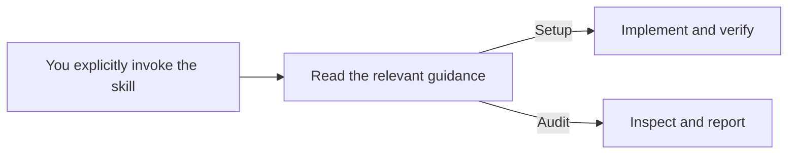
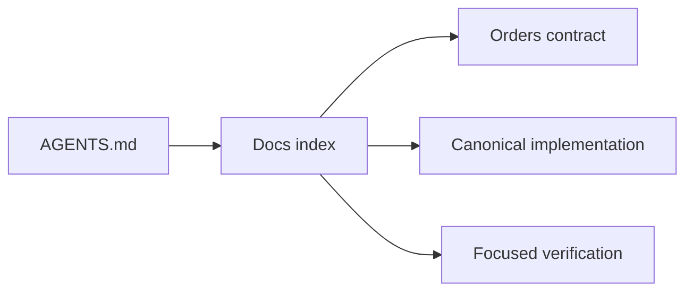
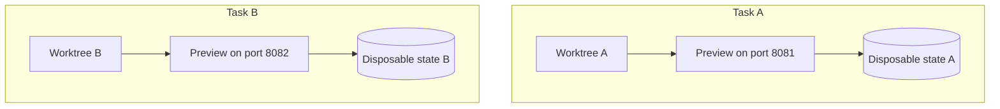

# Captain's Kit — Agentic Programming

**Give your coding agent a project it can understand, run, change and verify.**

Point an agent at this repository to set up a new project or audit an existing
one. Captain's Kit provides one manually invoked skill,
**`agentic-environment-setup`**, with practical playbooks for the environment
around your code: project knowledge, repeatable setup, code boundaries,
verification, diagnostics and handoffs.

The hypothesis is simple: better project foundations should mean fewer
interruptions, fewer repeated explanations and more correct delegated changes.
The kit helps you implement those foundations and measure whether they help.

[Quick start](#quick-start) · [Implementation examples](#key-implementations) ·
[Audit example](#what-an-audit-looks-like) · [Installation](#install-the-skill) ·
[Sources](#where-the-ideas-come-from)



**Setup** makes applicable improvements using the project's existing tools.
**Audit** leaves the project unchanged and returns evidence plus the highest
priority repairs. Both work with new and established codebases; an empty project
can start with a small map and a next milestone before choosing a stack.

## Quick start

Give your agent the repository URL and one of these prompts. Installation is
optional when the agent can read the repository and follow its linked files.

### Set up a project

```text
Use https://github.com/hekevin2000/captains-kit to set up this project for
agentic development. Read skills/agentic-environment-setup/SKILL.md and the
setup references. Treat this as an explicit invocation.

Inspect what already exists, implement the highest-priority missing
foundations, and verify the changes. Adapt to this project's stack and
conventions. Report what changed, what was verified, and what remains.
```

### Audit a project

```text
Use https://github.com/hekevin2000/captains-kit to audit this project's
readiness for AI coding agents. Read skills/agentic-environment-setup/SKILL.md
and the audit references. Treat this as an explicit invocation.

Do not change the project. Show evidence for each finding, distinguish
unverified claims from missing capabilities, and recommend the top three fixes.
```

If the agent cannot read GitHub, clone this repository and provide the local path
to [SKILL.md](skills/agentic-environment-setup/SKILL.md).

## Key implementations

These are **illustrative improvements the skill can help implement in your
project**. The paths, commands, outputs and results below describe a fictional
orders application. They are not application infrastructure bundled with this
kit. Reuse an adequate existing solution; add only what the project needs.

### 1. A small map that leads to the right context

An agent fixing an order bug needs the order contract, a canonical implementation
and a relevant check. Keep those discoverable through a short entrypoint.



An example excerpt from the target project's `AGENTS.md`:

```markdown
Read docs/README.md first, then the instructions for the area being changed.

Orders:
- Public API: src/orders/index.ts
- Contract and rules: docs/orders.md
- Canonical example: src/orders/create-order.ts
- Focused check: npm test -- orders
```

Put detailed domain rules in their maintained references. Read the relevant area
when the task needs it, and update its documentation with the source changes.

**Proof it works:** a fresh session finds the public entrypoint, contract,
example and check without needing the original conversation.

### 2. Repeatable setup with an identifiable environment

Give a fresh checkout a documented route to readiness. Setup should preserve
chosen configuration on repeated runs; a diagnostic command should explain
missing prerequisites without exposing secret values.

Example commands and output a JavaScript project might provide:

```text
$ npm run agent:setup
Dependencies ready. Existing development configuration preserved.

$ npm run agent:doctor
Checkout: codex/order-validation
Runtime: supported
Required configuration: present
Backend: disposable-orders-test
Preview: stopped — start when needed
```

For parallel tasks that change persistent state, isolation needs to cover the
backend as well as the checkout:



Worktrees isolate source files. Separate preview ports alone do **not** isolate
database rows, storage or queues. The diagram illustrates separate state where
the project supports it and the tasks need it.

**Proof it works:** prepare a disposable checkout twice, confirm configuration
survives, and identify the actual preview and backend targets. A stopped preview
is fine for tasks that do not need one.

See the conditional [state-isolation checklist](skills/agentic-environment-setup/references/state-isolation.md).

### 3. Code boundaries with errors that explain the repair

Turn a few consequential conventions into compiler, linter or structural checks.
A useful failure tells the agent what went wrong and where the permitted pattern
lives.

Example output from a project's import-boundary rule:

```text
src/checkout/submit-order.ts:4 — orders/public-api

Disallowed: import { createOrder } from "@/orders/internal/create-order";
Use:        import { createOrder } from "@/orders";

Other modules must use the orders public API.
Reference: docs/architecture.md#module-boundaries
```

Extend the existing checks before introducing a new framework. Start with a real
source of mistakes, such as forbidden dependency direction, bypassed data
adapters or unvalidated external input.

**Proof it works:** a valid example passes, a violating example fails, and the
normal local/CI command reports the repair. Legacy exceptions stay narrow.

### 4. Acceptance criteria that can be executed

Give the agent an observable definition of done before it starts a change.

```text
Task: Reject orders with a negative quantity.

Given: an order containing an item with quantity -1
When:  the create-order API is called
Then:  it returns the documented validation error
And:   no order or order line is persisted

Verification:
- The focused regression test detects the original defect.
- The same test passes after the fix.
- The API contract check passes against disposable test state.
```

Use the project's existing tests and fixtures. For a UI change, also exercise
the relevant browser journey; for a CLI, check output and exit behavior.
Run the project's required checks before reporting the work ready.

**Proof it works:** the evidence establishes the requested behavior, including
the relevant failure path. A completion message alone is insufficient.

### 5. Runtime evidence the agent can actually use

Start with existing logs, browser tools or CLI diagnostics. An interactive
application might expose a small, sanitized development snapshot:

```json
{
  "checkout": "codex/order-validation",
  "routeTemplate": "/orders/:id",
  "operation": "create-order",
  "outcome": "validation_error",
  "durationMs": 42,
  "environment": "disposable-orders-test"
}
```

This is illustrative output, not a required schema. Report enough to connect a
failure to its environment and operation. Exclude credentials, request bodies,
record identifiers and user content from shareable diagnostics. Bound retention
and explain what the collector does not observe.

**Proof it works:** reproduce a synthetic failure, identify the failing operation,
and verify that sensitive fixture values are absent. A small CLI may need only
clear stderr and exit codes.

### 6. A handoff another session can resume

For work spanning sessions, preserve decisions and evidence in an existing issue
or a compact task record.

```text
Objective: Reject invalid order quantities.
Revision: abc1234 (illustrative)
Decision: Validate at the API boundary using the existing quantity schema.
Completed: Validation and regression test added.
Verified: Focused quantity tests passed at the recorded revision.
Remaining: Check the API error contract.
Resume: Read docs/orders.md, then run the focused contract check.
```

**Proof it works:** a fresh session can identify the next action and reproduce
the last relevant check. When measuring improvement, compare correctness,
human interventions and time on representative tasks.

Use the [task-record template](skills/agentic-environment-setup/assets/templates/task-record.md)
and [evaluation guidance](skills/agentic-environment-setup/references/evaluate.md).
The full [setup playbook](skills/agentic-environment-setup/references/setup.md)
covers implementation and verification for all six foundations.

## What an audit looks like

An audit reports what the evidence supports. This fictional example shows why
the existence of a script is different from demonstrated readiness:

| Area | Status | Evidence and limitation |
| --- | --- | --- |
| Focused context | Verified, sampled area | Orders docs point to the current public API and focused check. |
| Repeatable environment | Partial | Bootstrap exists; readiness output omits the backend target. Repeatability has not been exercised. |
| Code boundaries | Missing | Cross-module internal imports are permitted despite the documented rule. |
| Executable acceptance | Unverified | Tests are present, but runtime prerequisites are unavailable. |
| Runtime visibility | Partial | Errors are visible, but evidence cannot identify the running checkout. |
| Continuity and outcomes | Partial | A task record exists; fresh-session handoff and outcome comparisons are unverified. |

One resulting recommendation:

> **High priority: identify the development backend.**
>
> **Evidence:** readiness reports configuration presence but not its target.
>
> **Smallest repair:** report a non-secret environment identity using the existing
> configuration mechanism.
>
> **Acceptance:** a fresh checkout identifies its intended disposable backend.
>
> **Uncertainty:** bootstrap repeatability still needs a separate authorized test.

The report ranks up to three improvements and marks irrelevant capabilities
**Not applicable**. It does not turn unknowns into green checks or hide a
blocking problem inside an overall percentage.

Read the [audit rubric](skills/agentic-environment-setup/references/audit.md)
or use the [report template](skills/agentic-environment-setup/assets/templates/audit-report.md).

## Install the skill

Requires Git and Python 3.10 or newer. The installer has no Python package
dependencies. The target project must be an existing directory. Run these
commands from a terminal:

```sh
git clone https://github.com/hekevin2000/captains-kit.git
cd captains-kit
python scripts/install.py --project /absolute/path/to/your-project --host codex
```

Windows PowerShell example:

```powershell
python scripts/install.py --project 'C:/GITHUB PROJECTS/Your Project' --host codex
```

| Host | Installer option | Installed location inside your project | Explicit invocation |
| --- | --- | --- | --- |
| Codex | `--host codex` | `.agents/skills/agentic-environment-setup/` | `$agentic-environment-setup setup this project` |
| Claude Code | `--host claude` | `.claude/skills/agentic-environment-setup/` | `/agentic-environment-setup setup this project` |

Replace `setup` with `audit` to inspect a project without changing it.

The installer copies the complete skill. It does not execute project setup,
install project dependencies or change global settings, and it refuses to
overwrite an existing installation. Compare and update an installed copy
deliberately when adopting a newer kit version.

Manual invocation is configured through Codex's `agents/openai.yaml` policy and,
in the Claude copy, `disable-model-invocation: true`. The workflow and supporting
references are loaded when invoked and needed. This keeps detailed guidance out
of standing project instructions; host metadata and context accounting can vary.

See [Codex skill documentation](https://learn.chatgpt.com/docs/build-skills) and
[Claude Code skill documentation](https://code.claude.com/docs/en/skills).

## What's in this repository

| Resource | Purpose |
| --- | --- |
| [Skill entrypoint](skills/agentic-environment-setup/SKILL.md) | Select setup or audit and load relevant guidance. |
| [Setup](skills/agentic-environment-setup/references/setup.md) and [audit](skills/agentic-environment-setup/references/audit.md) playbooks | Detailed procedures and evidence criteria. |
| [Templates](skills/agentic-environment-setup/assets/templates/README.md) | Adaptable project map, task record and audit report. |
| [Source digests](skills/agentic-environment-setup/references/sources/README.md) | Five attributed Markdown backups of the core ideas. |
| [Installer](scripts/install.py) | Copy the skill into a project for Codex or Claude Code. |
| [Package checker](scripts/check.py) and [tests](tests/test_install.py) | Validate kit packaging, local file links and installer behavior. |

The agent performs setup or audit by following the skill. The Python scripts
install and validate the kit itself; they are not a codebase audit scanner.

## Where the ideas come from

The kit draws on five OpenAI and Anthropic engineering articles cited in the
optimization work that motivated it:

| Article | Local digest |
| --- | --- |
| [OpenAI: Harness engineering](https://openai.com/index/harness-engineering/) | [Repository foundations](skills/agentic-environment-setup/references/sources/openai-harness-engineering.md) |
| [Anthropic: Effective context engineering](https://www.anthropic.com/engineering/effective-context-engineering-for-ai-agents) | [Focused context](skills/agentic-environment-setup/references/sources/anthropic-context-engineering.md) |
| [Anthropic: Effective harnesses for long-running agents](https://www.anthropic.com/engineering/effective-harnesses-for-long-running-agents) | [Continuity across sessions](skills/agentic-environment-setup/references/sources/anthropic-long-running-harnesses.md) |
| [Anthropic: Demystifying evals for AI agents](https://www.anthropic.com/engineering/demystifying-evals-for-ai-agents) | [Observable outcomes](skills/agentic-environment-setup/references/sources/anthropic-agent-evals.md) |
| [Anthropic: Harness design for long-running apps](https://www.anthropic.com/engineering/harness-design-long-running-apps) | [Calibrating orchestration](skills/agentic-environment-setup/references/sources/anthropic-harness-design.md) |

The digests preserve core ideas and attribution as concise original summaries,
not full article text. The playbooks are this project's synthesis. These practitioner
reports do not establish a universal productivity gain; use the
[evaluation guide](skills/agentic-environment-setup/references/evaluate.md) to test
the hypothesis on your own work. [Field lessons](skills/agentic-environment-setup/references/field-lessons.md)
record generalized design lessons without exposing private sessions or application data.

## Maintain the kit

```sh
python scripts/check.py
python -m unittest discover -s tests -v
```

The package checker validates local file links and the skill contract. It does
not validate Mermaid rendering, fragment anchors or external websites.

See [AGENTS.md](AGENTS.md) for contribution guidance. Original kit content is
[MIT licensed](LICENSE); publishers retain their rights to the linked articles.
