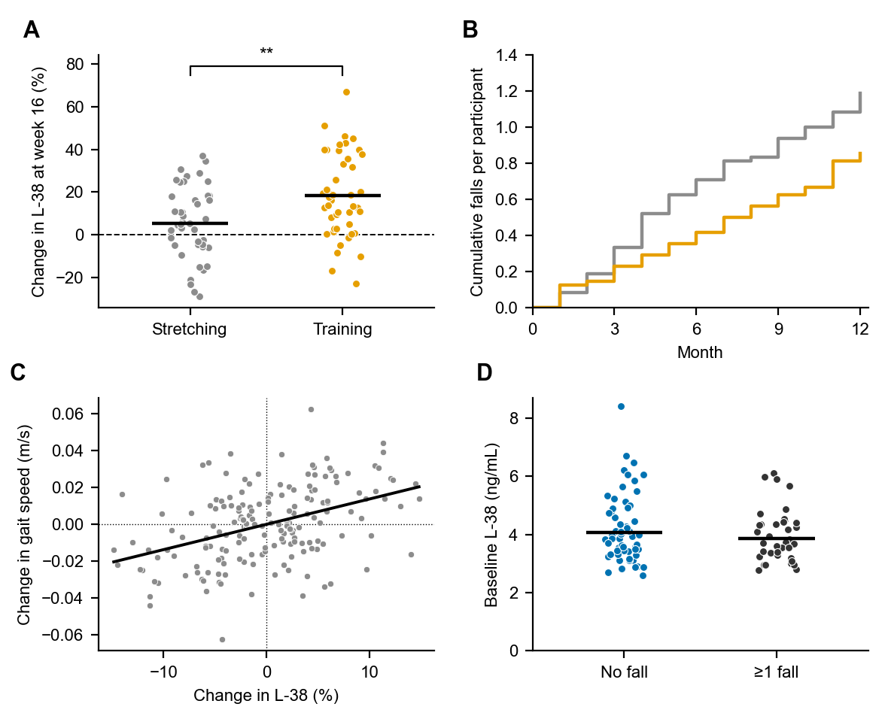

<!-- Synthetic example for msw.py new-manuscript. The study, marker ("L-38"), numbers, people,
     places and citations are invented; the PMIDs are placeholders that do not point to real
     evidence for these sentences. The bracketed declaration text marks wording the author takes
     from the journal and from their own AI-tool records. -->

# Abstract

Falls are frequent in later life, yet no blood measure shows whether an older person is responding to exercise meant to prevent them. In a 16-week randomized trial, 96 community-dwelling adults aged 70 to 89 years were assigned to supervised balance training or to a stretching program of equal contact time; the fictional serum protein L-38 was measured by blinded immunoassay at baseline and at weeks 8 and 16, and falls were recorded for 12 months. Between-arm effects were estimated with a linear mixed model for L-38 and negative binomial regression for falls. At week 16, L-38 was higher after balance training than after stretching (ratio of geometric means 1.16, 95% confidence interval 1.05 to 1.28; <i>P</i> = 0.004). Falls were less frequent in the training arm, but the rate ratio was imprecise (0.71, 95% confidence interval 0.46 to 1.10; <i>P</i> = 0.12). In exploratory analyses, within-person rises in L-38 accompanied faster gait, and baseline L-38 was similar in people with and without a recent fall. Serum L-38 rises with balance training in older adults and may help to monitor the response; its value for predicting falls needs an adequately powered trial.

Abbreviations

| Abbreviation | Definition |
| --- | --- |
| CI | confidence interval |
| SD | standard deviation |
| SPPB | Short Physical Performance Battery |

\pagebreak

# 1. Introduction

Roughly a third of people older than 65 years fall at least once a year, and falls are a leading cause of injury and loss of independence at that age [PMID: 12345678]. Exercise that challenges balance lowers the rate of falls and is recommended for older adults at risk [REF: guideline-2022]. Responses differ widely between individuals, however, and the performance tests used to follow them change slowly [PMIDs: 23456789, 34567890]. An objective measure that moves early with training would let clinicians see sooner who benefits.

L-38 is a circulating protein released by contracting skeletal muscle [PMID: 45678901]. Its serum concentration rises for several hours after a single exercise session in young adults, but adipose tissue also secretes it, so one measurement cannot tell which tissue contributed.

Whether repeated balance training changes resting L-38 in older adults, and whether such a change relates to physical function or to falls, remains uncertain; no randomized comparison has been reported.

This analysis aimed to (i) estimate the effect of 16 weeks of balance training on serum L-38; (ii) compare the rate of falls over 12 months between arms; (iii) relate within-person changes in L-38 to changes in gait speed; and (iv) describe baseline L-38 by fall history in the preceding year.

# 2. Methods

## 2.1 Participants

Ninety-six community-dwelling adults aged 70 to 89 years (58 women) with at least one risk factor for falling were recruited from primary care practices in Example City between March 2023 and February 2024. The trial was approved by the Example University Research Ethics Board (reference EX2023017, 12 January 2023) and followed the Declaration of Helsinki (2013 revision); each participant gave written consent. People unable to walk 10 m without help or with a progressive neurological disease were excluded. The target of 96 participants was set in the registered protocol for its primary outcome, the Short Physical Performance Battery (SPPB) score.

## 2.2 Intervention

Participants were randomized 1:1, stratified by sex, to supervised balance training or a stretching program with the same schedule of three 45-min group sessions a week for 16 weeks (weeks 0–16). Instructors recorded attendance at every session.

## 2.3 Measurements

Fasting venous blood was drawn at baseline and at weeks 8 and 16, left to clot for 30 min, spun at 1,500 × <i>g</i> for 15 min at 4 °C and then frozen at −80 °C. Serum L-38 was measured in duplicate with a sandwich immunoassay (Example L-38 Assay, Example Biotech, Example City, Example Country [catalog number 4417]). Gait speed was timed over 4 m at each visit, and falls were recorded on monthly calendars for 12 months. Laboratory staff did not know the allocation, and each participant's samples were assayed on one plate in random order.

## 2.4 Statistical analysis

The statistical analysis plan, finalized before the allocation was revealed, named the between-arm ratio of geometric mean L-38 at week 16, adjusted for baseline, as the principal estimand of this analysis; the SPPB score, which the protocol named as the trial's primary outcome, is reported separately, falls were a randomized secondary outcome, and the gait-speed and fall-history analyses were exploratory. Values are mean ± SD, or median and interquartile range when skewed, and all randomized participants were analyzed in their allocated arm. Analyses used Python 3.12 with statsmodels 0.14.2 and pingouin 0.5.4. L-38 was log-transformed after inspection of normal probability plots, and baseline groups were compared with two-sided Welch <i>t</i> tests. Values more than five SD from the mean were checked against the laboratory records and kept. The mixed model used all available visits, assuming that missing week-16 values were missing at random. A two-sided <i>P</i> < 0.05 was taken as statistically significant; secondary and exploratory results were not adjusted for multiplicity, and "prespecified" refers to the statistical analysis plan. The effect on L-38 came from a linear mixed model of log L-38 at weeks 8 and 16 with arm, visit, their interaction and baseline log L-38 as fixed effects and a random intercept per participant; falls were compared with negative binomial regression with follow-up time as an offset, and repeated-measures correlation (<i>r</i>rm) described how L-38 and gait speed changed together within participants.

# 3. Results

## 3.1 L-38 by randomized arm

We first estimated the effect of training on L-38. Week-16 samples were available from 89 of 96 participants (93%). L-38 rose by 19% in the training arm (95% CI 11%–28%) and by 3% in the stretching arm (95% CI −4% to 10%); the ratio of geometric means at week 16 was 1.16 (95% CI 1.05–1.28; <i>P</i> = 0.004; Figure 1A).

## 3.2 Falls by randomized arm

During 12 months of follow-up, 41 falls were recorded in the training arm and 57 in the stretching arm. The incidence rate ratio was 0.71 (95% CI 0.46–1.10; <i>P</i> = 0.12; Figure 1B); the sample size was not set for this outcome, and the estimate was imprecise.

## 3.3 Within-person change in L-38 and gait speed

Across the week-8 and week-16 visits, participants whose L-38 rose more also walked faster (<i>r</i>rm = 0.27, 95% CI 0.08–0.44; Figure 1C). This exploratory association does not show that L-38 lies on the path from training to function.

## 3.4 Baseline L-38 by fall history

At baseline, 38 participants reported a fall in the preceding year. Their L-38 was similar to that of participants without a fall (ratio 0.94, 95% CI 0.83–1.07; <i>P</i> = 0.35; Figure 1D). Because fall history was not randomized, this comparison is descriptive.

# 4. Discussion

In this randomized trial, 16 weeks of balance training raised serum L-38 relative to stretching, the primary result of this analysis. The effect on falls was imprecise; in exploratory analyses, within-person changes in L-38 moved with gait speed, and baseline L-38 did not separate people with and without a recent fall.

## 4.1 L-38 as a marker of training response

Earlier studies in young adults described short-lived rises in L-38 after single exercise sessions [PMID: 56789012]. The sustained rise seen here after repeated training suggests that resting L-38 also reflects adaptation in older adults. Because adipose tissue secretes L-38 as well, these data cannot identify the tissue responsible; a study that pairs serum samples with muscle biopsies could settle this.

# 5. Conclusions

In this randomized trial, balance training raised serum L-38 in older adults (primary result), whereas its effect on falls was imprecise (secondary result). The link with gait speed is exploratory, and L-38 needs validation in an independent cohort before it is used to monitor training or to judge the risk of falling.

# Limitations

Participants were volunteers with few chronic conditions, so the effect of training may be smaller in frailer patients. Falls were self-reported on monthly calendars, which can miss falls without injury.

# Declaration of interest

[The journal's standard sentence stating that the authors have no conflict of interest.]

# Funding

The Example Research Fund supported this work (grant 12345).

# Contributions

<b>Avery A. Author:</b> Conceptualization, Formal analysis, Writing – original draft.

<b>Blake B. Writer:</b> Supervision, Funding acquisition, Writing – review & editing.

<b>Casey C. Scholar:</b> Investigation, Writing – review & editing.

# Data availability

Deidentified data can be requested from the corresponding author.

# Acknowledgements

We thank the participants and the exercise instructors.

<b>Use of generative AI:</b> [Tool name, version or model, and provider] was used to edit the language of the Introduction; the authors checked every change and take responsibility for the text.

# References

# Figure Legends

## Figure 1: Serum L-38, falls and gait speed by randomized arm and fall history.

{width=150mm}

(A) Change in serum L-38 from baseline to week 16 in the stretching arm (gray, n = 44) and the balance-training arm (orange, n = 45); the dashed line is zero change. The between-arm ratio of geometric means was estimated with the linear mixed model (randomized primary contrast; two-sided <i>P</i> = 0.004). (B) Cumulative falls per participant during 12 months of follow-up by arm (colors as in A; n = 48 each); rate ratio from negative binomial regression (randomized secondary outcome; two-sided <i>P</i> = 0.12). (C) Changes in L-38 and gait speed at weeks 8 and 16, each centered on the participant's own mean (points are visits of 89 participants); the line shows the common within-person slope from repeated-measures correlation (exploratory). (D) Baseline L-38 in participants without (blue, n = 58) and with (black, n = 38) a fall in the preceding year; two-sided Welch <i>t</i> test on log values (cross-sectional, exploratory). In A and D, points are participants, spread sideways for legibility, and horizontal lines show means (A) or geometric means (D). Panels A to D answer aims (i) to (iv) in order. P values are unadjusted. **<i>P</i> < 0.01.
